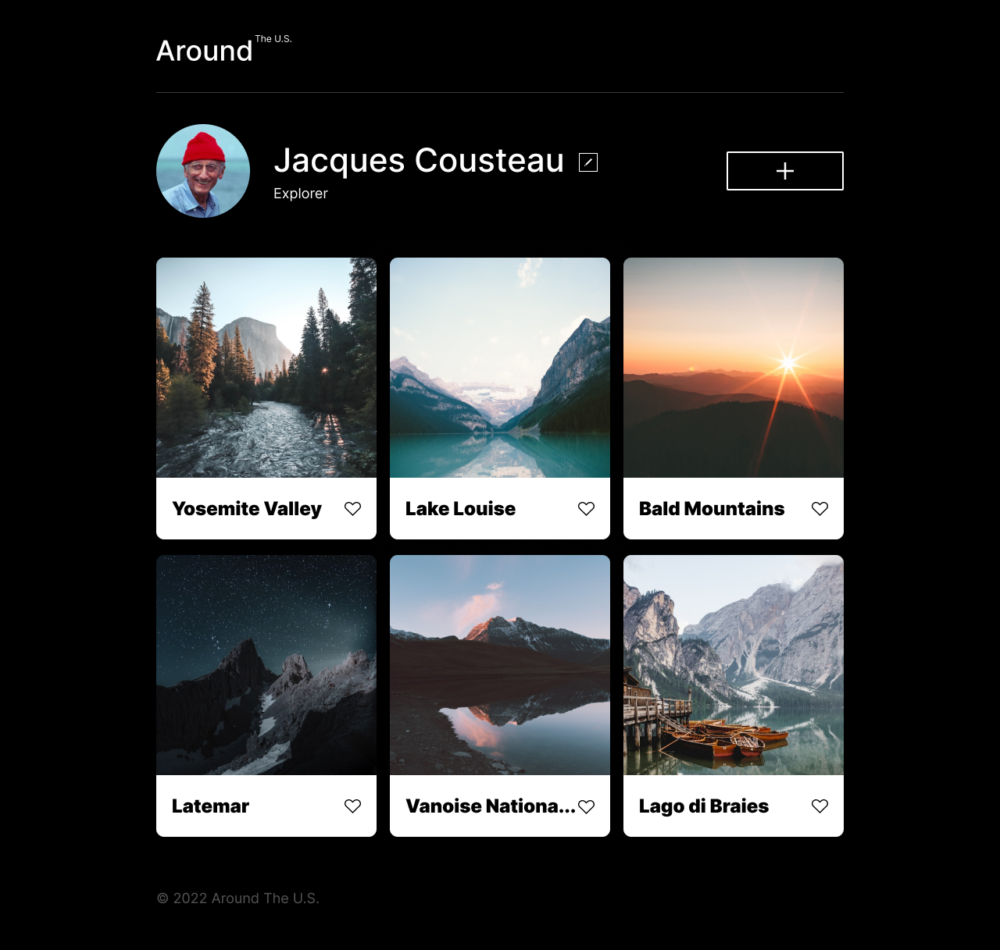

# Project 3: Around The U.S.

**Intro**

This project is made so all the elements are displayed correctly on popular screen sizes. We recommend investing more time in completing this project, since it's more difficult than previous ones.

**Technologies Used**

- HTML
- CSS
- Responsive design with Grid and Flexbox

**Plans for Improvement**

- Reduce number of breakpoints and find opportunities for smoother transitions
- Adding pagination instead of solely grid cards

**Figma**

- [Link to the project design on Figma](https://www.figma.com/file/ii4xxsJ0ghevUOcssTlHZv/Sprint-3%3A-Around-the-US?node-id=0%3A1)

**Pages**

- [View it HERE](https://mgildenberg.github.io/se_project_aroundtheus/)

**Images**

1280px Screenshot

